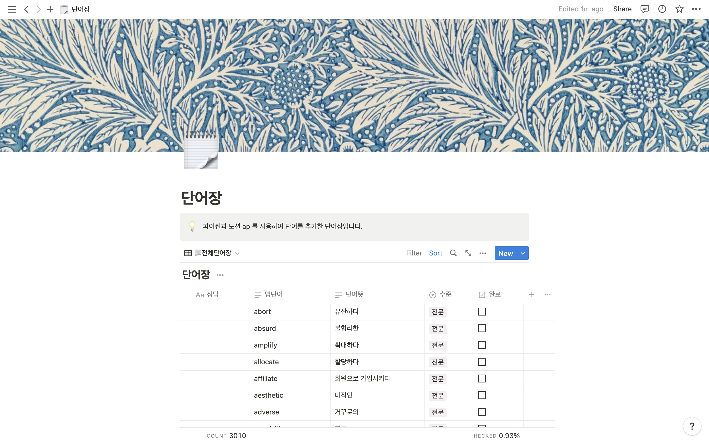

# 파이썬으로 노션 api와 엑셀 다루기
---

- 이 저장소에는 excel to json 파일과 노션 api에 요청을 보내는 파일 두가지 프로그램이 있습니다.
    - 이것을 이용하여 3000개의 단어가 들어있는 excel 파일을 노션 데이터베이스에 넣을 수 있었습니다.

- `.env` 파일 커스터마이징
  - `TOKEN`: Notion API 권한 토큰
  - `DATABASE_ID`: 수정할 데이터베이스의 id
  - `PATH`: excel 파일과 json 파일이 있는 경로
